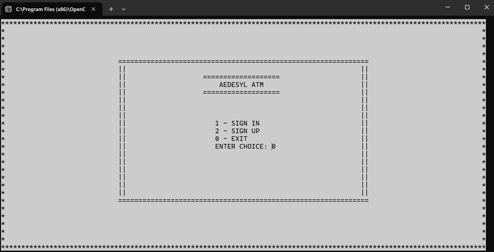
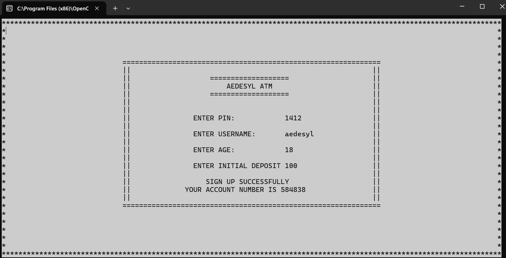
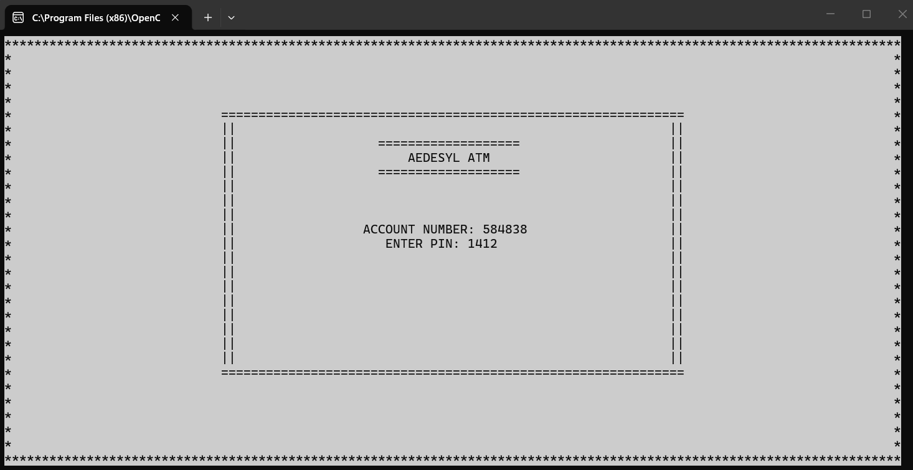
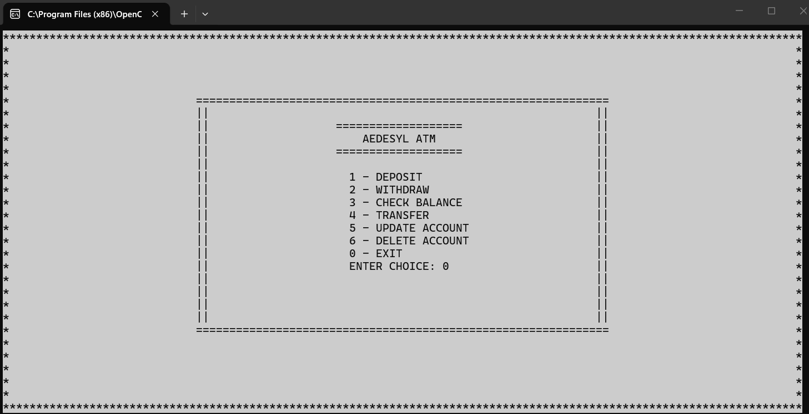
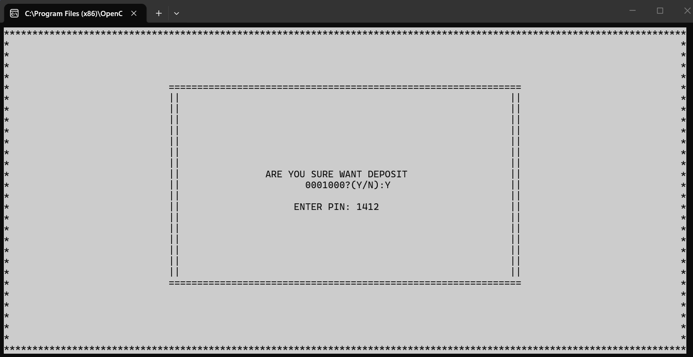
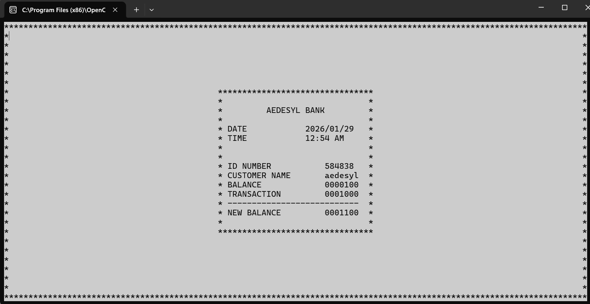
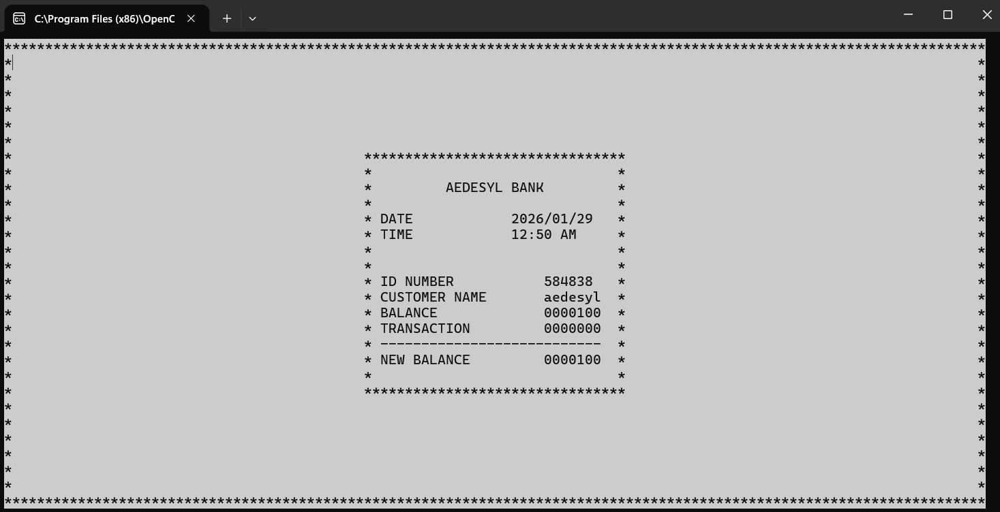

# COBOL ATM Banking System

A fully-featured console-based ATM (Automated Teller Machine) banking system written in COBOL with an interactive terminal interface, complete with PIN authentication, file handling, and transaction receipts.



## 📋 Table of Contents
- [Overview](#overview)
- [Features](#features)
- [Screenshots](#screenshots)
- [Technical Implementation](#technical-implementation)
- [Requirements](#requirements)
- [Installation](#installation)
- [Usage Guide](#usage-guide)
- [Security Features](#security-features)
- [File Structure](#file-structure)
- [Error Handling](#error-handling)

## Overview

**AEDESYL ATM** is a comprehensive console-based banking system that simulates real ATM operations. Built entirely in COBOL, it demonstrates professional file handling, security authentication, and transaction processing in a legacy programming environment.

### Key Highlights
- 🔐 Secure PIN-based authentication with attempt limits
- 💰 Complete banking operations (Deposit, Withdraw, Transfer)
- 🧾 Digital receipt generation with timestamps
- 📁 Persistent data storage using indexed files
- ⚠️ Robust error handling and validation
- 🎨 Formatted console interface with borders

## Features

### 🔑 User Authentication
- **Sign In**: Secure login with account number and 4-digit PIN
- **Sign Up**: New account creation with auto-generated account numbers
- **Security Lockout**: Automatic exit after 3 failed authentication attempts
- **PIN Verification**: Required for every transaction to ensure security

### 💳 Banking Operations

| Operation | Description |
|-----------|-------------|
| **Deposit** | Add funds to your account with confirmation |
| **Withdraw** | Remove funds with balance validation |
| **Check Balance** | View account details with receipt or screen display options |
| **Transfer** | Send money to other accounts with recipient validation |
| **Update Account** | Modify PIN, username, and personal information |
| **Delete Account** | Permanently remove account from the system |
| **Exit** | Secure logout with confirmation prompt |

### 🧾 Receipt System
- **Digital Receipts**: View formatted receipt layout on screen
- **Timestamps**: Every receipt includes date and time of transaction
- **Transaction Details**: Shows previous balance, transaction amount, and new balance
- **Optional Printing**: Choose between screen display or receipt format

### ⚡ Error Handling
- **Insufficient Balance**: Prevents withdrawals exceeding current balance
- **Invalid Account**: Alerts when account number doesn't exist
- **PIN Validation**: Ensures secure authentication for all operations
- **Input Validation**: Checks for valid amounts and account numbers

## Screenshots

### Landing Page

*Main menu offering Sign In, Sign Up, and Exit options*

### Sign Up Process

*New account creation with PIN setup, username, age, and initial deposit. System generates a unique account number for the new user.*

### Sign In Authentication

*Account number and PIN entry for existing users. Users must provide the generated account number from registration.*

### Main Banking Menu

*Complete menu of available banking operations: Deposit, Withdraw, Check Balance, Transfer, Update Account, Delete Account, and Exit*

### Deposit Transaction

*Deposit process with amount entry, confirmation, and PIN verification for security*

### Insufficient Balance Error

*Error handling when attempting to withdraw more than the current balance. System displays remaining balance and prevents overdraft.*

### Receipt After Transaction

*Option to view receipt after completing a transaction, showing transaction summary*

### Digital Receipt

*Formatted digital receipt displaying bank name, date, time, account details, previous balance, transaction amount, and new balance*

## Technical Implementation

### File Handling
The system uses **indexed sequential file organization** for efficient data management:

```cobol
SELECT INFO
    ASSIGN TO "C:\OPENCOBOL\TEXTFILE\ATM2.txt"
    ORGANIZATION IS INDEXED
    ACCESS MODE IS RANDOM
    RECORD KEY IS ACC-NUM
```

### Data Structure

| Field | Type | Size | Description |
|-------|------|------|-------------|
| `ACC-NUM` | Numeric | 5 digits | Account number (Primary Key) |
| `USER_NAME` | Alphanumeric | 9 characters | Customer name |
| `AGE` | Numeric | 2 digits | Customer age |
| `BALANCE` | Numeric (Signed) | 7 digits | Account balance |
| `PASSWORD` | Numeric | 4 digits | PIN for authentication |

### Authentication Flow
1. User enters account number
2. System validates account existence using indexed file lookup
3. User enters PIN (maximum 3 attempts)
4. PIN verified against stored record
5. System grants access or locks out after failed attempts

### Transaction Security
Every transaction requires PIN re-authentication:
- Prevents unauthorized operations after login
- Validates user identity before critical actions (deposit, withdraw, transfer)
- Maintains security throughout the entire session

## Requirements

- **COBOL Compiler**: OpenCOBOL/GnuCOBOL 1.1 or higher
- **Operating System**: Windows, Linux, or macOS
- **Terminal Requirements**:
  - Minimum 120 columns × 30 rows
  - Support for COBOL screen positioning
  - Color display capability (optional but recommended)

## Installation

### 1. Install COBOL Compiler

**Windows:**
```bash
# Download GnuCOBOL from:
# https://sourceforge.net/projects/gnucobol/
```

**Linux (Ubuntu/Debian):**
```bash
sudo apt-get update
sudo apt-get install open-cobol
```

**macOS:**
```bash
brew install gnu-cobol
```

### 2. Clone Repository
```bash
git clone https://github.com/Johnas-Bautista/cobol-group-project.git
cd cobol-group-project
```

### 3. Create Data Directory
```bash
# Windows
mkdir C:\OPENCOBOL\TEXTFILE\

# Linux/macOS (update path in atm.cbl line 12)
mkdir -p ~/cobol-data/
```

### 4. Compile Program
```bash
cobc -x atm.cbl -o atm
```

### 5. Run Application
```bash
# Windows
atm.exe

# Linux/macOS
./atm
```

## Usage Guide

### Creating Your First Account

1. **Launch the program** and select option `2` (Sign Up)
2. **Enter a PIN**: Must be 4 digits (1000-9999)
3. **Provide username**: Maximum 9 characters
4. **Enter your age**: 2-digit number
5. **Make initial deposit**: Any amount
6. **Save your account number**: System generates and displays a unique 6-digit account number

### Signing In

1. Select option `1` (Sign In) from the main menu
2. Enter your 6-digit **account number** (generated during sign up)
3. Enter your 4-digit **PIN**
4. ⚠️ **Important**: You have only 3 attempts before automatic lockout

### Making Transactions

#### Deposit Money
```
1. Select option 1 (Deposit) from banking menu
2. Enter amount to deposit (or 0 to exit)
3. Confirm transaction (Y/N)
4. Enter PIN for verification
5. View new balance
6. Optional: Print digital receipt with timestamp
```

#### Withdraw Money
```
1. Select option 2 (Withdraw) from banking menu
2. Enter amount to withdraw (or 0 to exit)
3. System validates sufficient balance
4. Confirm transaction (Y/N)
5. Enter PIN for verification
6. View new balance
7. Optional: Print digital receipt
```

#### Check Balance
```
1. Select option 3 (Check Balance)
2. Choose display format:
   - SHOW: View on screen
   - PRINT: Digital receipt format with timestamp
3. View complete account information
```

#### Transfer Money
```
1. Select option 4 (Transfer) from banking menu
2. Enter recipient account number
3. System validates recipient exists
4. Enter transfer amount (or 0 to exit)
5. Confirm transaction (Y/N)
6. Enter PIN for verification
7. System validates sufficient balance
8. Transfer processed and receipt available
```

#### Update Account
```
1. Select option 5 (Update Account)
2. Enter your account number (or 0 to exit)
3. Provide new PIN (4 digits)
4. Update username
5. Update age
6. Changes saved immediately to file
```

#### Delete Account
```
1. Select option 6 (Delete Account)
2. Enter account number to delete (or 0 to exit)
3. Confirm deletion (irreversible action)
4. Account permanently removed from system
```

### Viewing Digital Receipts

After each transaction, you'll be prompted:
```
DO YOU WANT A RECEIPT?(Y/N):
```

**Digital Receipt includes:**
- 🏦 Bank name (AEDESYL BANK)
- 📅 Transaction date (YYYY/MM/DD format)
- 🕐 Transaction time (HH:MM AM/PM format)
- 🆔 Account number
- 👤 Customer name
- 💵 Previous balance
- 💰 Transaction amount (deposit/withdraw/transfer)
- ✅ New balance after transaction

## Security Features

### 🔐 Multi-Layer Protection

1. **PIN Authentication**
   - Required at login and for every transaction
   - 4-digit numeric PIN (1000-9999)
   - Stored securely in indexed file

2. **Attempt Limiting**
   - Maximum 3 failed login attempts
   - Automatic system lockout with exit
   - Prevents brute-force attacks

3. **Transaction Verification**
   - PIN re-verification for all critical operations
   - Confirmation prompts (Y/N) for irreversible actions
   - Account validation before transfers

4. **Balance Protection**
   - Prevents overdrafts with balance checking
   - Validates sufficient funds before withdrawal/transfer
   - Clear error messages for insufficient balance
   - Shows remaining balance when transaction fails

5. **Account Validation**
   - Verifies account existence before operations
   - Checks recipient accounts during transfers
   - Prevents operations on non-existent accounts
   - Error handling with retry options

## File Structure

```
cobol-group-project/
├── atm.cbl                              # Main COBOL source code (1000+ lines)
├── ATM2.txt                             # Indexed data file (auto-generated)
├── README.md                            # This documentation
├── bin/                                 # Compiled binaries
├── landingpage.png                      # Landing page screenshot
├── signup_with_initial_deposit.png      # Sign up process
├── sign-in_using_generated_account_number.png  # Sign in screen
├── transactionpage.png                  # Banking menu
├── deposit.png                          # Deposit transaction
├── insufficient_balance.png             # Error handling
├── receipt_after_transaction.png        # Receipt prompt
└── digitalprinting_of_receipt.png       # Digital receipt display
```

## Error Handling

### Comprehensive Validation

| Error Scenario | System Response | Recovery Action |
|----------------|-----------------|-----------------|
| **Account doesn't exist** | "ACCOUNT NUMBER DOESN'T EXIST" | Return to login, allow retry |
| **Wrong PIN** | "WRONG PIN REMAINING ATTEMPTS: X" | Allow up to 3 attempts |
| **Too many attempts** | "TOO MANY ATTEMPTS! EXITING!!!" | Automatic logout for security |
| **Insufficient balance** | "INSUFFICIENT BALANCE" display with remaining balance | Show current balance, return to menu with retry option |
| **Invalid account (transfer)** | "ID NUMBER DOESN'T EXISTS" | Allow retry or return to menu |
| **Invalid PIN format** | "INVALID. PIN MUST BE 4 DIGITS" | Re-prompt for valid PIN |
| **Account not found (update)** | "ACCOUNT DOES NOT EXISTS" | Return to menu |
| **Zero amount entered** | Prompt: "DO YOU WANT TO CONTINUE?(Y/N)" | Option to continue or return |
| **File operation error** | Display appropriate error message | Graceful handling with menu return |

### Graceful Exit Options
- Every operation offers exit option (enter 0)
- Confirmation prompts for critical actions
- Option to continue or logout after transactions
- Safe file closing on exit

## Database Operations

### CRUD Functionality

- **CREATE**: Sign Up creates new account records with auto-generated account numbers
- **READ**: All operations read account data using indexed file access
- **UPDATE**: Modify account details, balances after transactions
- **DELETE**: Permanently remove accounts from the system

### File Operations
```cobol
OPEN I-O INFO          → Open file for input/output operations
READ INFO              → Retrieve account record by account number
WRITE INFO-RECORD      → Create new account during sign up
REWRITE INFO-RECORD    → Update existing record (balance, details)
DELETE INFO            → Remove account record permanently
CLOSE INFO             → Close file safely before exit
```

### Data Persistence
- All account information stored in `ATM2.txt`
- Indexed organization allows fast random access
- Account number serves as primary key
- File remains persistent between program executions
- Automatic file creation if not exists

## Development Team

Created by **Johnas-Bautista** and team as an educational project demonstrating:
- Legacy system programming in COBOL
- File handling and indexed sequential access
- Security implementation in banking systems
- Transaction processing logic
- Console-based user interface design
- Error handling and data validation

## License

This project is open-source and available for educational purposes. Feel free to use, modify, and learn from the code.

## Acknowledgments

- Built with **OpenCOBOL/GnuCOBOL**
- Inspired by real-world ATM systems
- Educational project for learning COBOL programming and file handling

---

**⚠️ Disclaimer**: This system is for educational purposes only. Do not use in production environments without implementing additional security measures such as encryption, secure PIN storage, audit logging, and comprehensive testing.

**🎓 Learning Objectives Achieved**:
- ✅ File handling in COBOL (indexed sequential files)
- ✅ CRUD operations with persistent storage
- ✅ Authentication and security with PIN verification
- ✅ Transaction processing with balance management
- ✅ Error handling and input validation
- ✅ Console interface design with formatted displays
- ✅ Date and time manipulation for receipts
- ✅ Menu-driven program architecture